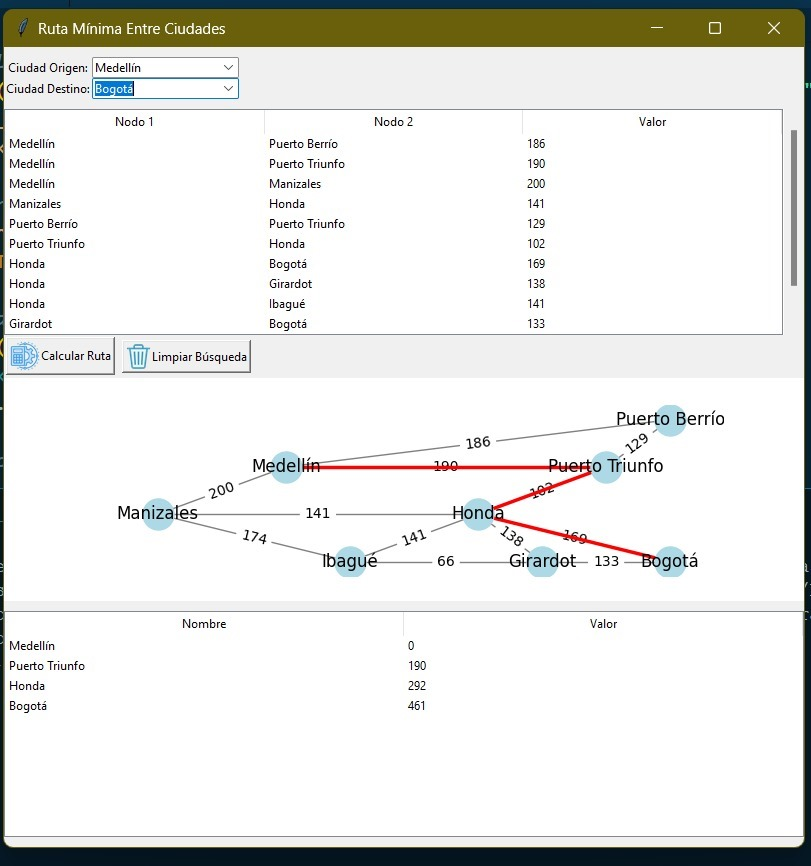

# Ruta Mínima Entre Ciudades

Este proyecto es una aplicación gráfica desarrollada en Python que permite calcular y visualizar la ruta mínima entre diferentes ciudades, utilizando grafos y el algoritmo de ruta más corta. La interfaz gráfica facilita la interacción del usuario, mostrando tanto la ruta calculada como el grafo correspondiente.

**Propósito del Proyecto:**

Este proyecto/parcial fue desarrollado con el objetivo de **aprender Python bajo el paradigma funcional** y explorar el **uso de librerías** como `networkx`, `matplotlib`, `pandas` y `tkinter` para la creación de aplicaciones gráficas y manipulación de datos. A través de este proyecto, se busca comprender cómo aplicar conceptos de programación funcional en Python y cómo integrar diversas librerías para resolver problemas complejos de manera eficiente.

## Descripción

La aplicación carga un conjunto de ciudades y las distancias entre ellas desde un archivo CSV. Utiliza la librería `networkx` para crear un grafo que representa las conexiones entre las ciudades y `matplotlib` para dibujar el grafo. El usuario puede seleccionar una ciudad de origen y una de destino, y la aplicación calculará la ruta más corta entre ellas, mostrando la distancia acumulada y resaltando la ruta en el grafo.

## Características

- Interfaz gráfica intuitiva construida con `tkinter`.
- Cálculo de la ruta mínima entre dos ciudades seleccionadas.
- Visualización del grafo de ciudades y rutas, con la ruta mínima resaltada.
- Tabla interactiva que muestra las rutas y distancias disponibles.
- Funcionalidad para limpiar la búsqueda y reiniciar la visualización.

## Requisitos

- Python 3.6 o superior.
- Las siguientes librerías de Python (incluidas en `requirements.txt`):
  - `tkinter` (generalmente incluido con Python).
  - `Pillow` (para manejo de imágenes).
  - `pandas` (para manipulación de datos).
  - `networkx` (para crear y manejar grafos).
  - `matplotlib` (para dibujar el grafo).

## Instalación de librerías

Si prefieres instalar las librerías manualmente, puedes ejecutar:
`pip install pillow pandas networkx matplotlib`

## Uso

Asegúrate de que todos los archivos necesarios están en el mismo directorio:

`ruta_minima.py` (script principal).
`Util.py` (archivo de utilidades).
`rutas.csv` (archivo con los datos de las ciudades y distancias).
Carpeta `iconos` con las imágenes `calcular.png` y `limpiar.png`

## Interacción con la aplicación

- Selecciona la ciudad de origen y la ciudad de destino utilizando los desplegables.
- Haz clic en "Calcular Ruta" para obtener la ruta mínima.
- La ruta y la distancia acumulada se mostrarán en la tabla inferior, y el grafo resaltará la ruta en rojo.
- Puedes hacer clic en "Limpiar Búsqueda" para reiniciar y realizar otra consulta.

## Capturas de Pantalla

A continuación, se muestra una captura de pantalla de la aplicación en funcionamiento:

## Notas Importantes

- Compatibilidad: El proyecto ha sido probado con Python 3.12 y debería funcionar en versiones superiores a Python 3.6.
- Imágenes y Rutas: Asegúrate de que las imágenes utilizadas (calcular.png, limpiar.png) están en la carpeta iconos y que las rutas en el código apuntan correctamente a ellas.
- Módulo Util: Este módulo es necesario para la ejecución del programa. Está incluido en los archivos proporcionados y contiene funciones para simplificar la creación de la interfaz gráfica.

## Autor

Alumnos: - Elena Vargas Grisales
         - Esteban Luna Seña

Correo: `ele92gris@gmail.com`

Institución: Universidad de Antioquia- Facultad de Ingeniería

Docente: Fray León Osorio Rivera- Ingeniero de Sistemas
